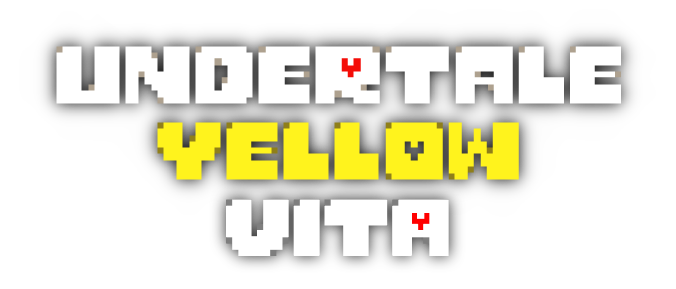
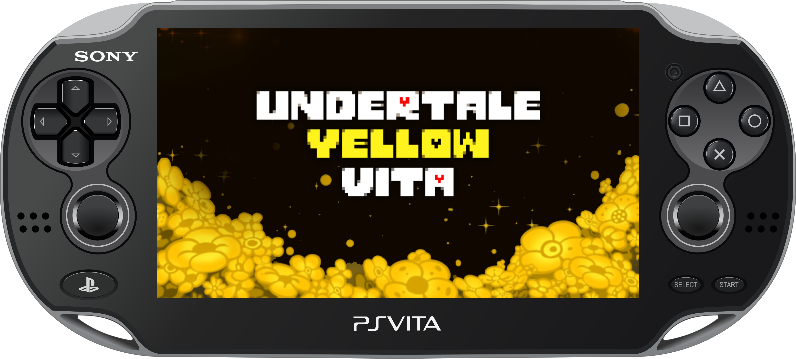
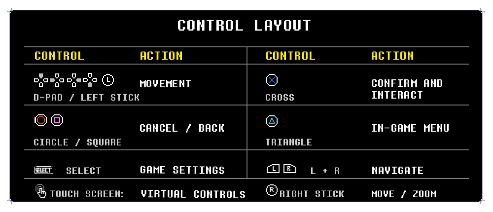
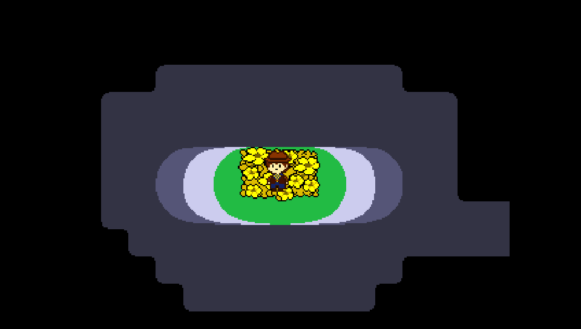
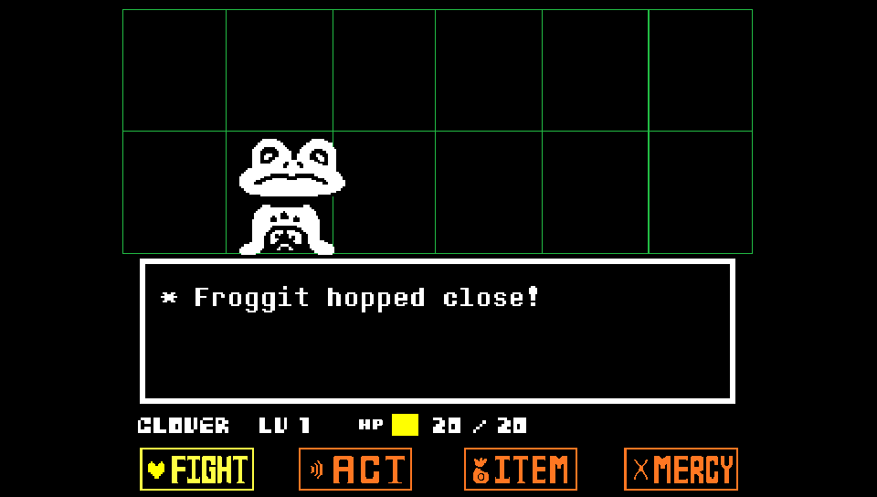
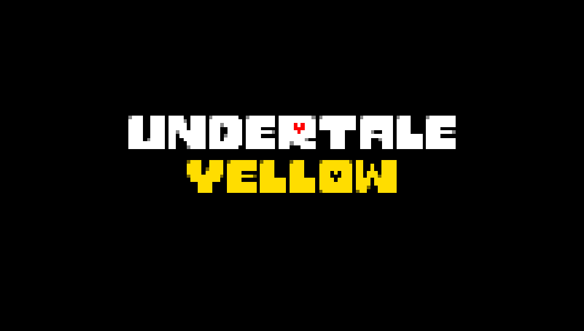
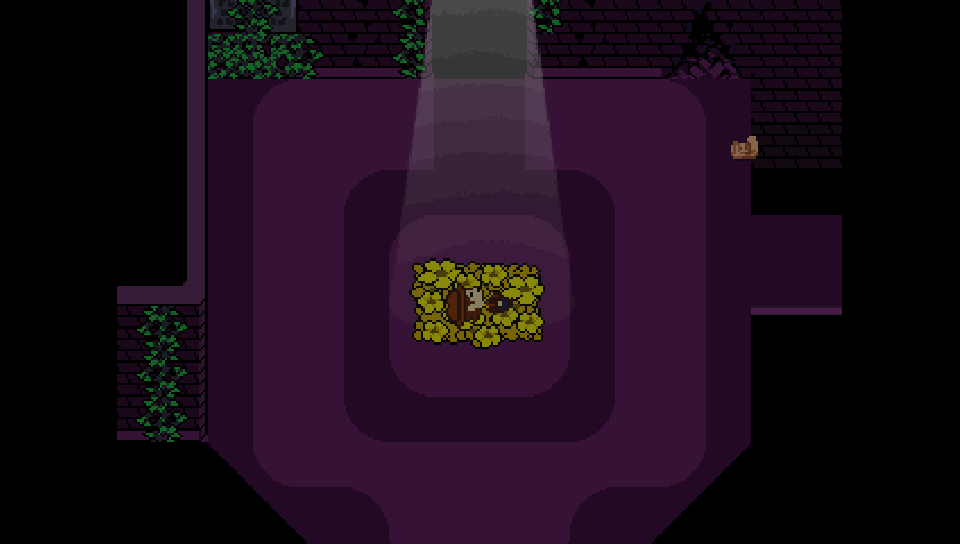
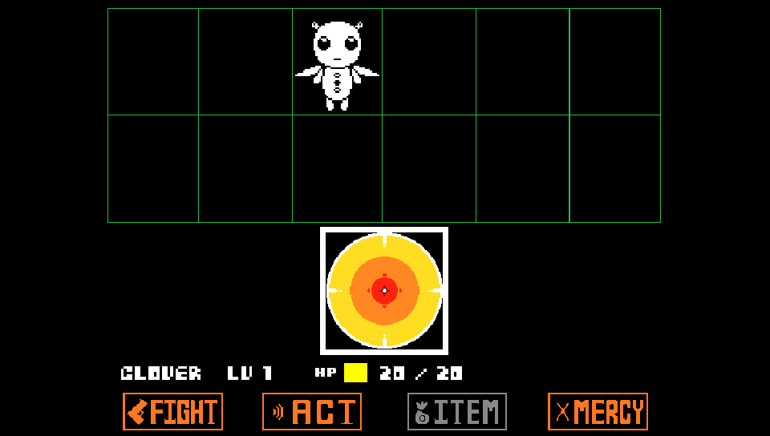

<p align="center">
  <a href="#">
    
  </a>
</p>
<p align="center">
  
</p>

An _unofficial_ native port of **Undertale Yellow** for the PlayStation Vita.

The project runs the full Undertale Yellow game using a customized version of the [Butterscotch](https://github.com/ButterscotchRunner/Butterscotch) engine, with hardware-accelerated rendering powered by [VitaGL](https://github.com/rinnegatamante/vitagl). UndertaleYellowVita features native PS Vita controls, touch controls, customizable Game Settings menu (audio, brightness, screen filters, calibration, control remapping), OpenAL audio streaming, and high-performance texture management tailored for the PS Vita.

Asset preparation and texture optimization are powered by [DeltaRepack](https://github.com/WolffsRoom/DeltaRepack) and [DeltaCache](https://github.com/WolffsRoom/DeltaCache).

> [!NOTE]
> **Undertale Yellow** is a free fan-made prequel to Toby Fox's *UNDERTALE*, developed by **Team Undertale Yellow**.
> You can support the creators and check the original release on [Game Jolt](https://gamejolt.com/games/UndertaleYellow/136925).

## Project Status

<div align="center">
  <a href="https://github.com/WolffsRoom/UndertaleYellowVita/releases"></a>
  <a href="https://github.com/WolffsRoom/UndertaleYellowVita/releases/latest"></a>
  <br>
  
  
  
</div>

<div align="center">

### Support this and other projects
If you enjoy my work and porting projects, consider supporting the development!

[](https://www.buymeacoffee.com/5rsrt7j4z8f)

</div>

<br>

---

## Installation Guide

To install and run **Undertale Yellow** on your PS Vita, follow the instructions below:

### Prerequisites

- Install [kubridge](https://github.com/TheOfficialFloW/kubridge/releases/) and [FdFix](https://github.com/TheOfficialFloW/FdFix/releases/) by copying `kubridge.skprx` and `fd_fix.skprx` to your taiHEN plugins folder (typically `ux0:tai/`) and adding these entries under `*KERNEL` in your `config.txt`:

  ```text
  *KERNEL
  ux0:tai/kubridge.skprx
  ux0:tai/fd_fix.skprx
  ```

  > **Note:** If you are already using the `rePatch` plugin, do not install `fd_fix.skprx`.

- Install `libshacccg.suprx` (if not already present) by following the [ShaCC runtime extractor guide](https://samilops2.gitbook.io/vita-troubleshooting-guide/shader-compiler/extract-libshacccg.suprx).
- **Optional:** Install [PSVshell](https://github.com/Electry/PSVshell/releases) to overclock your CPU to 500 MHz for optimal framerate stability during intensive battle sequences.

---

### Step-by-Step Installation

Because **Undertale Yellow** is a free fangame, no PC patching tools or Steam validation steps are required:

1. Download the latest `UndertaleYellow.vpk` and the pre-configured `undertale-yellow.zip` data package from the [Releases](https://github.com/WolffsRoom/UndertaleYellowVita/releases/latest) page.
2. **Extract `undertale-yellow.zip` on your PC or another device first.**
   > [!IMPORTANT]
   > Do **NOT** extract the ZIP file directly on the PS Vita using VitaShell. Due to the high number of texture and audio files, extracting on the Vita is extremely slow. Always unzip on your computer beforehand.
3. Transfer the extracted `undertale-yellow` folder into `ux0:data/` on your PS Vita via VitaShell USB (recommended) or FTP.
4. Install `UndertaleYellow.vpk` using **VitaShell**.
5. Launch the game from your LiveArea!

---

## Folder Structure

Ensure that the files were copied correctly and match the following layout:

```text
ux0:data/undertale-yellow/
├── data.win
├── options.ini
├── mus/
│   └── (all .ogg soundtrack files)
├── snd/
│   └── (all .ogg sound effect files)
├── pvr/
│   └── (hardware-compressed GPU texture pages)
└── texture-cache/
    └── (prepared 16-bit RGBA4444 texture pages)
```

---

## Control Layout

The control layout is adapted for the PlayStation Vita, matching the console experience with support for physical buttons and on-screen touch controls:

<p align="center">
  
</p>

---

## Screenshots (on PS Vita)

<p align="center">
  
  
</p>
<p align="center">
  
  
  
</p>

---

## Game Settings Features

Press **Select** at any time to access the built-in Vita Game Settings:

* **Screen and Video:**
  * **Screen Filters:** None (Crisp Pixel Art), Scanlines (CRT TV lines), Sharp Bilinear (Smooth scaling), Dithering Blending, and VHS.
  * **Adjust Screen:** Real-time screen boundary framing, positioning, and zoom calibration.
  * **FPS Targets:** 30 FPS, 40 FPS, 60 FPS, and Uncapped.
  * **Brightness:** Hardware brightness adjustment slider.
* **Audio:**
  * Master Volume, Music Volume, SFX Volume, and complete Audio Mute toggles.
* **Controls:**
  * Custom Button Remapping.
  * Virtual Touch Controls toggle, scale, and layout editor.
* **System and Performance:**
  * Texture format profiles (Optimized vs Native).
  * VSync and diagnostic overlay telemetry.

---

## Building from Source

To compile the VPK yourself using Docker and VitaSDK:

1. Clone the repository:
   ```bash
   git clone https://github.com/WolffsRoom/UndertaleYellowVita.git
   cd UndertaleYellowVita
   ```

2. Compile the project with Docker:
   ```powershell
   .\scripts\build-vita.ps1 Release
   ```

3. The generated VPK will be located at:
   ```text
   src/vita/build/UndertaleYellow.vpk
   ```

---

## Credits and Acknowledgements

* **Team Undertale Yellow** — For creating the incredible [Undertale Yellow](https://gamejolt.com/games/UndertaleYellow/136925) fangame and masterpiece soundtrack.
* **Toby Fox** — Creator of the original *UNDERTALE* and *DELTARUNE*.
* **[DeltaRepack](https://github.com/WolffsRoom/DeltaRepack)** — GameMaker texture repacking tool used to optimize atlas memory usage for the PS Vita.
* **[DeltaCache](https://github.com/WolffsRoom/DeltaCache)** — Texture cache builder used to generate GPU-ready RGBA4444 and BC3/PVR formats.
* **Rinnegatamante** — For the amazing [VitaGL](https://github.com/rinnegatamante/vitagl) graphics library.
* **The Official FloW** — For `kubridge` and core PS Vita development tools.
* **Butterscotch Team** — For the open-source GameMaker runtime foundation.

---

## AI Notice

GPT-5.6 Sol (Codex IDE) was integrated into the workflow to assist with core development (specifically the loader's programming logic), diagnostics, project organization, and technical documentation. Additionally, Claude Code (Opus 4.8) was utilized to re-document the project for the current release, while Gemini (3.6 Flash) was used during development.
